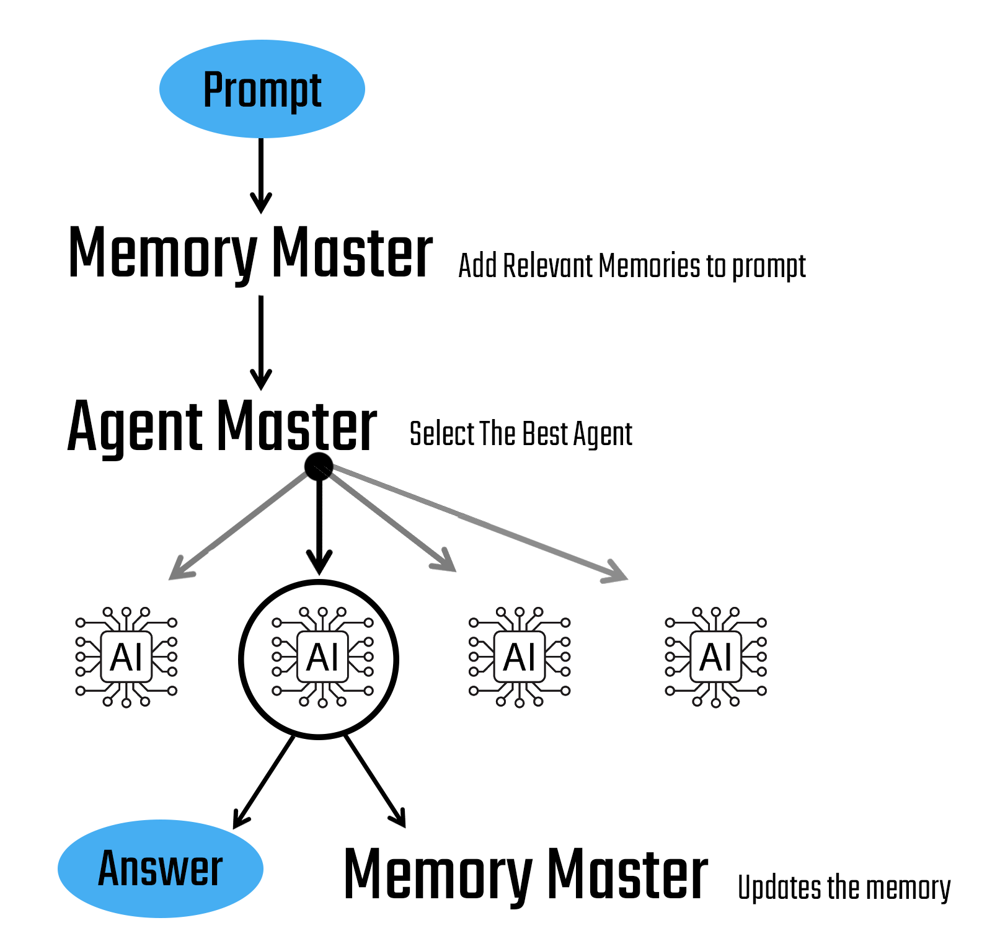

# Simple Multi-Agent AI Framework to test the Deepseek 1.5B model

Overview

This project is a simple attempt at building a multi-agent AI system, designed as a hands-on experiment with the smallest DeepSeek model, a reasoning model (perfect for a decision making AI). The framework is lightweight and modular, allowing for easy integration of different agent functionalities, such as memory storage, LinkedIn and company data retrieval, and chatbot interactions.

Because the intended model has only 1.5B parameters, only the current prompt is passed to the LLM. The idea to overcome the small number of parameters was to have the MemoryMaster—an agent responsible for judging important information that should be kept for future use or retrieved for the current prompt, as illustrated below.



Imagined Features:

- MasterAgent: Selects the best agent to handle a given task.

- MemoryMaster: Stores and retrieves information from memory for contextual awareness.

- LinkedInConnector: Generates personalized LinkedIn connection messages. (not implemented. I would implement it by having it calling the LinkedInSearcher bot for both the user and the target, then with this informations, it would do some resoning and then generate the answer.)

- LinkedInSearcher: Retrieves information about individuals from LinkedIn. (not implemented. I would implement it with simplicity in mind. Using Linkedin API if available or just some normal web scrapping)

- CompanySearcher: Fetches company data using web scraping or APIs. (not implemented. Here I might still implemente when I have the time because it is a great opportunity to test crawl4ai + knowledge graph. It seems to be very effective with even very simple models)

- NewsSearcher: Gathers relevant news articles from various sources. (not implemented. The same as the company searcher or just using news API)

- ChatBot: A general-purpose assistant for answering user queries.

## Installation

Prerequisites

vLLM installed and running locally
1. **Ensure Python 3.x is installed**:
   - Verify the installation by running:
     ```bash
     python3 --version
     ```

2. **Install pip**:
   - If not already installed, install pip:
     ```bash
     sudo apt-get install -y python3-pip
     ```

3. **Install Rust and Cargo**:
   - These are dependencies for vLLM. Install them using rustup:
     ```bash
     curl --proto '=https' --tlsv1.2 -sSf https://sh.rustup.rs | sh
     source $HOME/.cargo/env
     ```

4. **Install vLLM**:
   - Use pip to install vLLM:
     ```bash
     pip install vllm
     ```

5. **Upgrade the transformers library**:
   - Ensure compatibility by upgrading transformers:
     ```bash
     pip install --upgrade transformers
     ```

6. **Start the vLLM server with the DeepSeek-R1-Distill-Qwen-1.5B model**:
   - Launch the server specifying the model and configurations:
     ```bash
     vllm serve deepseek-ai/DeepSeek-R1-Distill-Qwen-1.5B --max-model-len 4096
     ```

7. **Just hit main**
  - Or take a look in the GeneralPybook for better visualization of the different steps of the code.

## Tests

Only one test unit was done. Not really a test unity but the Test_Analysis.ipbnb runs the test questions to the Agent Master, save the answers and calculates the % of concistent and correct answers. Also plots the correlation between the multiple agents, as one can assume, there might be a tendence of error between the LinkedIn Agents, for exemple. 
